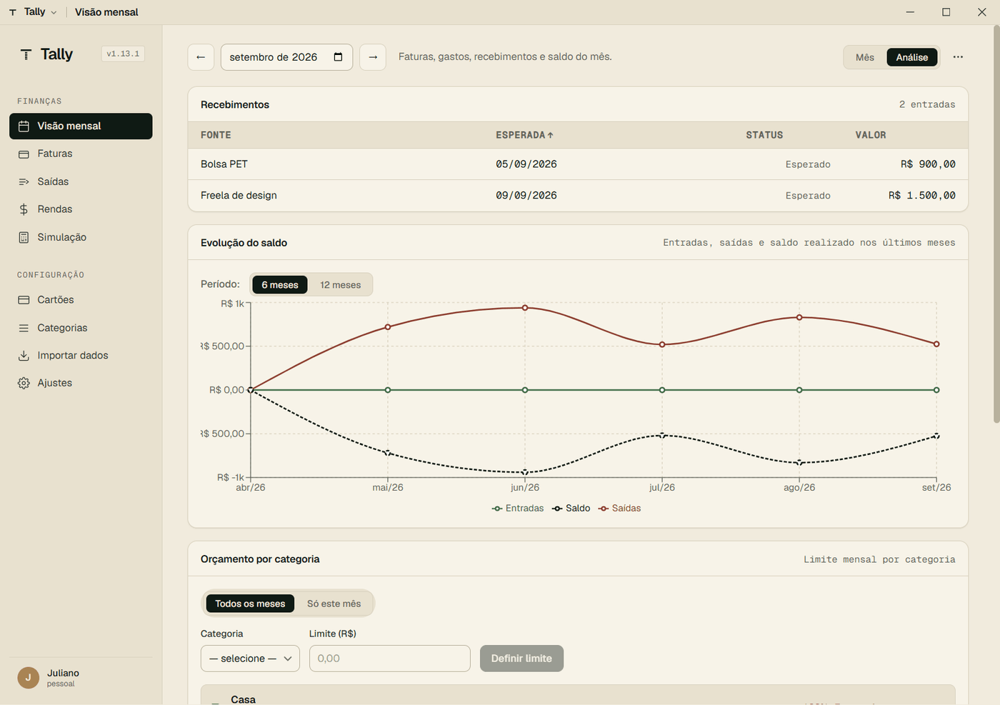
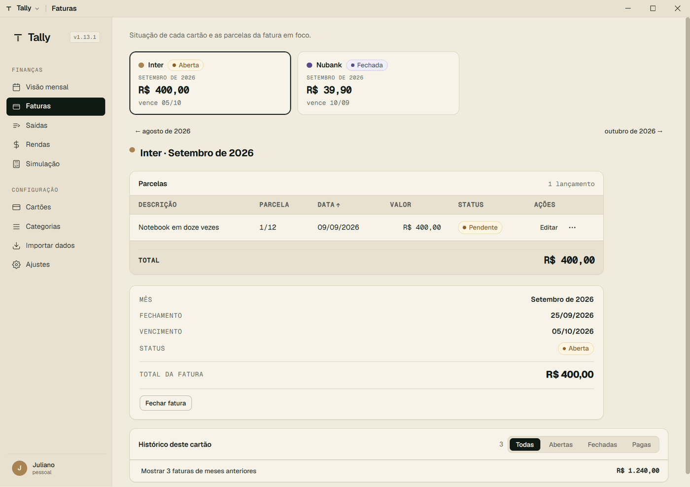
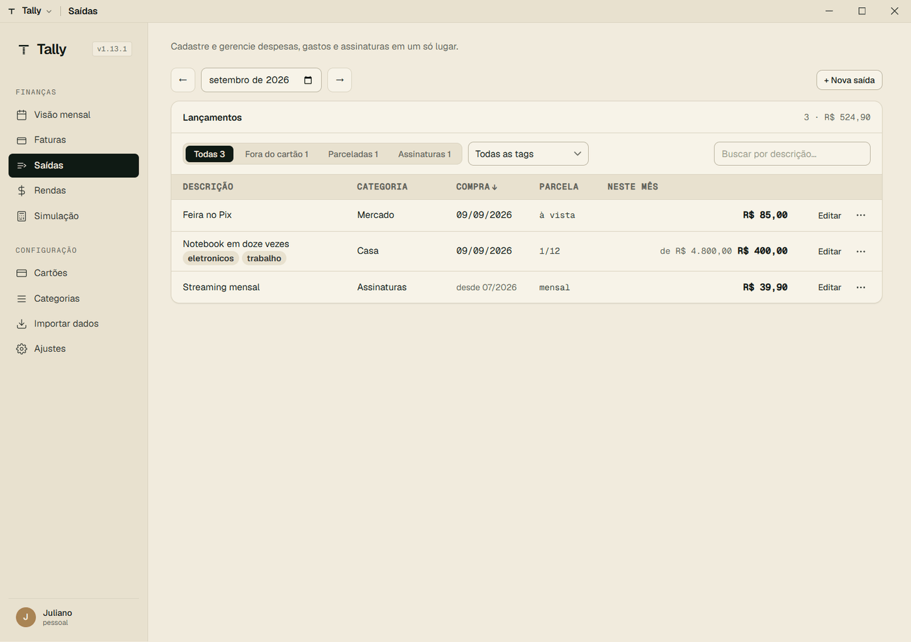
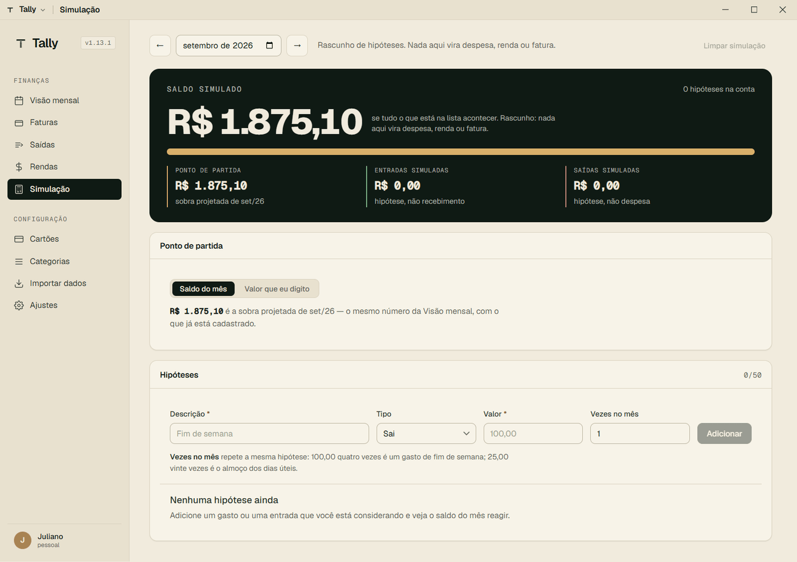

# Tally

> A desktop app for monthly personal finance tracking. Replaces the spreadsheet I duplicated every month with something that does the math itself.


Tally is a personal project built to replace a Google Sheets workflow that demanded manual work every month: copying the previous month's tab, incrementing parcela numbers (`7/12` → `8/12`), and recalculating credit card statement totals. Tally does all of it automatically.

It's also a portfolio piece for my repositioning to **QA / Test Automation Engineer** — built with test-driven development from the ground up and comprehensive automated test coverage across unit, integration, E2E, accessibility and mutation testing.

---

## What it looks like

|                                                                                                                                                                                           |                                                                                                                     |
| ----------------------------------------------------------------------------------------------------------------------------------------------------------------------------------------- | ------------------------------------------------------------------------------------------------------------------- |
|                                                                                                                                           |                                                                            |
| **Monthly view** — the month's projected leftover as the headline answer, an agenda of what is still going to happen, and per-category spending with budget limits drawn on the same bar. | **Statements** — every card's current statement in the top rail, the focused one open below without a single click. |
|                                                                                                                                                     |                                                                          |
| **Expenses** — one row per _occurrence_ in the month, not per registered expense, grouped by where the money leaves from.                                                                 | **Simulation** — a scratchpad for "what if I spend X?" that never touches real data.                                |

Screens are generated by `npm run smoke:visual`, which boots the packaged app against an isolated database, seeds representative data over IPC, and captures every screen at three window widths. There is also a dark theme.

---

## Why

Brazilian personal finance often involves credit card installments (parcelamentos), monthly subscriptions, and multiple cards with different closing/due dates. The spreadsheets people build around this get repetitive fast:

- Each month is a near-copy of the last, with parcela counters incremented by hand
- Future projection is impossible without manually building each upcoming month
- Categorization and "how much did I spend on subscriptions last quarter" require rebuilding the structure every time
- Off-card spending (Pix, debit, cash) lives in a different sheet — never consolidated with credit-card totals

Tally solves these with first-class support for installment plans, recurring subscriptions, per-card statement cycles, off-card spending, recurring/one-off income tracking, and multi-month projection.

---

## Tech stack

| Layer            | Technology                       |
| ---------------- | -------------------------------- |
| Runtime          | Node.js 20 LTS                   |
| Desktop shell    | Electron 42                      |
| Bundler          | Vite 5+                          |
| UI               | React 18 + TypeScript 5 (strict) |
| Database         | SQLite via node-sqlite3-wasm     |
| Unit testing     | Vitest                           |
| E2E testing      | Playwright                       |
| Lint / Format    | ESLint + Prettier                |
| Commit hygiene   | commitlint + Husky + lint-staged |
| Mutation testing | Stryker                          |

Architecture follows clean separation across four layers: **domain** (pure business rules, zero external dependencies), **persistence** (SQLite repositories), **main process** (Electron lifecycle and IPC), and **renderer** (React UI). See [`CONTRIBUTING.md`](./CONTRIBUTING.md) for setup and conventions.

---

## Quality engineering

Quality strategy is treated as a first-class concern, not an afterthought.

- **TDD mandatory in the domain layer.** All business rules (RN-01 through RN-08 documented in [`PRD.md`](./PRD.md)) start with a failing test before any implementation.
- **Coverage minimums:** 80% in the domain layer, 60% global.
- **Integration tests** run against in-memory SQLite to validate repositories without mocking the database.
- **E2E tests** (81 Playwright specs across 32 files against the real Electron app, each in an isolated temp database; several are parameterised across window widths, so more cases execute than are declared) cover the critical user flows: registering an in-progress installment plan, advancing parcelas, paying a statement — which locks its expenses against edit/deletion (RN-06) —, deleting expenses, navigating to a projected future month, per-category budgets, and reports. Beyond flows, they also assert things a click-through never catches: that no screen scrolls horizontally at three window widths, that row actions aren't clipped by their container, and that every page opens at the same left edge regardless of its width tier.
- **Accessibility scans** (axe-core via Playwright) run against every main screen — serious/critical WCAG violations fail the suite.
- **Mutation testing** (Stryker) runs against the domain layer, measuring whether the tests actually detect behavioral changes — not just line coverage. Current score: **92%** — 878 mutants, 794 killed, 63 survived, with 4 of the 16 domain services at 100% (measured 08/09/2026).
- **The whole pipeline runs locally** through npm scripts (`lint`, `typecheck`, `test:coverage`, `e2e`, `test:mutation`, `build`), run before opening a PR. Git hooks enforce the fast half automatically: pre-commit runs ESLint and Prettier on staged files, commit-msg validates Conventional Commits, and pre-push runs lint, typecheck, and the full unit suite.
- **Conventional Commits** enforced via commitlint, enabling automated changelog generation.

Bug reports during development follow a structured template (preconditions, steps, expected vs actual, severity, evidence) and live as GitHub Issues.

---

## Status

Tally has been in daily real use since **v1.0.0** and is currently at **v1.13.1**. The MVP and the whole V2 scope in [`PRD.md`](./PRD.md) are delivered; development continues in releases. The implementation was built in vertical slices — each one a thin end-to-end feature with UI, logic, persistence, and tests.

### Roadmap

- [x] **Slice 0** — Project setup (Electron + Vite + React + TS + SQLite + test runners + CI)
- [x] **Slice 1** — Domain foundation: migrations, base entities, statement-from-purchase-date rule
- [x] **Slice 2** — Cards CRUD with closing and due dates
- [x] **Slice 3** — Categories CRUD
- [x] **Slice 4** — One-shot expenses + statement creation
- [x] **Slice 4.5** — Visual identity: design system (tokens, Geist font, logo, UI primitives), full app restyle
- [x] **Slice 5** — Statement lifecycle (Open → Closed → Paid)
- [x] **Slice 6** — Installment expenses (new + in-progress migration + advancing parcelas + cancel pending)
- [x] **Slice 7** — Subscriptions (register, lazy occurrence generation, cancel, monthly value adjustment)
- [x] **Slice 8** — Off-card expenses (debit, Pix, cash) with month-grouped listing
- [x] **Slice 9** — Contributors and shared expenses with "owe me" dashboard, recurring aid replication, net-of-aid statement total
- [x] **Slice 10** — Income sources (recurring and one-off) with monthly receipt tracking, default-value adjustment, one-shot entries
- [x] **Slice 11** — Monthly consolidated view with cards, net balance (realized + projected), per-month navigation
- [x] **Slice 12** — Multi-month navigation and projection (lazy horizon extension up to 24 months ahead)
- [x] **Slice 12.1** — Cleanup and simplification: visual bug fixes, RF-DES-09 (expense deletion), Slice 9 rollback (Contributors + Aids removed), category icon and renda category removed
- [x] **Slice 12.2** — Rendas and Recebimentos screens unified under `/rendas` with segmented tabs (Recebimentos do mês / Fontes de renda)
- [x] **Slice 13** — Reports and visualizations (recharts: balance evolution + monthly category pie/ranking + per-category temporal line)
- [x] **Slice 14** — Hardening and polish (electron-builder NSIS + portable, coverage RNF-06, Toast/ConfirmDialog/useEscapeKey)
- [x] **Slice 14.1** — Post-MVP polish from real-use feedback: visual fixes, expense editing (RF-DES-10), income editing (RF-REN-06), per-row "Adiantar", column sorting, expense descriptions in invoice detail, Rendas grouped by type
- [x] **Slice 15** — Hardening, QA e cleanup pós-MVP: isolação E2E (TALLY_USER_DATA), hardening Electron + CSP, row-mappers consolidados, migrations 0003 (drop colunas mortas) + 0004 (normaliza `data_referencia`), Zod em todos os canais IPC, `noImplicitAny`, CI matriz Windows+Ubuntu com coverage gating, pre-push hook
- [x] **Bloco D — Orçamento por categoria** — limite mensal por categoria com status visual (ok/alerta/estourado, alerta >= 80%) integrado aos Relatórios; domínio puro em TDD, migration 0005 (índices parciais para o limite global), repositório, IPC tipado e cobertura no export/import
- [x] **Slice 19 — Reativação dos E2E** — os 6 specs Playwright pulados (`gastos`, `rendas`, `relatorios`, `assinaturas`, `excluir-despesa`, `visao-mensal`) realinhados à UI atual + novo spec de orçamento. 12 specs E2E verdes, zero skips
- [x] **Hardening pós-auditoria (jun/2026)** — auditoria completa do app fechada em 6 PRs: pagar fatura sincroniza parcelas para Paga (RN-06 passa a valer de fato, com migration de backfill e proteção de fatura Fechada contra edição/exclusão); datas "hoje" no fuso local em vez de UTC; feedback de erro em todas as telas (helper `mensagem-erro` + toasts); exclusão de recebimento avulso limpa a renda órfã; import valida cada tabela com Zod; E2E em paralelo (lock por `userData` isolado) + typecheck dos specs; CI matriz ubuntu + windows com E2E no Windows

From here the project stopped delivering in slices and started delivering in releases. One line each; the full account of every one is in [`CHANGELOG.md`](./CHANGELOG.md).

| Release                            | What shipped                                                                                                                                                                                                                                      |
| ---------------------------------- | ------------------------------------------------------------------------------------------------------------------------------------------------------------------------------------------------------------------------------------------------- |
| **v1.0.0** (jun/2026)              | Full audit closed across 6 PRs: paying a statement now really propagates to its installments (RN-06), "today" moved to local time, error feedback on every screen                                                                                 |
| **v1.1.0** (jul/2026)              | **Closes the entire V2 scope**: per-category budgets, CSV/PDF export, configurable backups, tags and notes. Plus auto-update, a CSV importer, OS notifications and a Settings screen                                                              |
| **v1.1.1** (jul/2026)              | Fix: row actions in Saídas were unreachable, not merely hidden, when the table outgrew its panel                                                                                                                                                  |
| **v1.2.0** (ago/2026)              | 8-phase UI/UX plan from a full interface audit. The accessibility scan had been running against an **empty** database — with data on screen it immediately found two serious WCAG violations                                                      |
| **v1.2.1–v1.2.3** (ago/2026)       | Fixes: every screen opened at a different left edge; due date computed a month late when the due day precedes the closing day; residual statements of an archived card stayed visible                                                             |
| **v1.3.0–v1.5.1** (ago/2026)       | Visual refactor in nine phases: balance hero and agenda, `SidePanel`, Faturas as a single screen with a card rail, then Rendas, Cartões, Categorias, Ajustes and Importar — one page width, six type steps, three densities                       |
| **v1.6.0–v1.6.2** (ago/2026)       | The month stepper becomes a shared `SeletorMes`; the note modal stops discarding typed text and six modal skeletons become one `Modal`; raw IPC error text on three screens, and a screen that could hang on "Carregando…" forever                |
| **v1.7.0–v1.8.0** (ago/2026)       | The window's two strips of system chrome become one 32px bar the app draws itself, giving ~56px of height back to every screen                                                                                                                    |
| **v1.9.0** (ago/2026)              | Dark theme, picked from three measured palettes. Getting there meant splitting a token that silently did three jobs; along the way the "Paga" badge turned out to fail WCAG AA and the monthly PDF would have printed white-on-white              |
| **v1.10.0–v1.10.1** (ago/2026)     | A one-off income entry no longer requires registering a source (migration `0011`); CSV formula-injection neutralised on export; Electron bumped seven Chromium patches forward                                                                    |
| **v1.11.0–v1.11.4** (ago–set/2026) | One grammar for typed money (the app had **two**, where the dot meant opposite things); backup restore hardened; prepared statements stopped leaking and locking tables; five defects from an open-ended sweep, none of them reported from use    |
| **v1.12.0** (set/2026)             | **Simulation** — the first new feature since V2 closed. Answers "what if I spend X?" without registering anything. Arrived named "Forecast" and was renamed before any code: in Tally those words already mean real data that hasn't happened yet |
| **v1.13.0** (set/2026)             | A recurring expense that never touches a card — rent, tuition, anything paid monthly by Pix. Forced an overdue correction: the monthly view counted off-card spending _per expense_ while the rest of the app counted _per occurrence_            |
| **v1.13.1** (set/2026)             | Full repository audit. **Security came back clean**, measured not assumed. What it found was a recurring shape of defect: a correct guard applied on the cold path and missing on the hot one                                                     |

### Detailed history

Every slice and release above is documented in full in
[`CHANGELOG.md`](./CHANGELOG.md) — what changed, why, and what it cost in
tests. This README used to carry a verbatim copy of those entries; it was
duplication, not documentation.

---

## Installation

Grab the latest binaries from [GitHub Releases](https://github.com/JulianoMRA/tally/releases) (built locally with `npm run dist` and uploaded to the release):

- **`Tally-Setup-<version>.exe`** — NSIS installer. Creates desktop + Start Menu shortcuts, lets you pick the install dir, supports clean uninstall. **Auto-updates**: the app checks GitHub Releases on startup (and via the `Arquivo > Verificar atualizações` menu) and applies new versions on quit.
- **`Tally-<version>-portable.exe`** — single-file executable. Just double-click — no install. Good for USB drives or restricted machines. Does **not** auto-update — download new versions manually.

On first launch Windows SmartScreen may warn that the publisher is unverified (the binary is unsigned — this is a personal project, not a commercial app). Click **More info → Run anyway** to proceed. Auto-update itself works on unsigned builds.

Your data lives in `%APPDATA%\tally\tally.db` regardless of which build you use (NSIS, portable, or `npm run dev`) and survives updates. Backups are written to `%APPDATA%\tally\backups\` on every boot and quit; you can also export everything as JSON via `Arquivo > Exportar dados`.

If an update never arrives, `%APPDATA%\Tally\logs\main.log` records what the updater found — the version it saw, the URL it queried, and any error.

---

## Getting started (development)

> **Prerequisites:** Node.js 20 LTS and npm.

```bash
git clone https://github.com/JulianoMRA/tally.git
cd tally
npm install
npm run dev
```

Useful scripts:

```bash
npm run dev            # Electron + Vite with hot reload
npm run test:run       # Vitest single run
npm run test:coverage  # Vitest with coverage (80% domain / 60% global gates)
npm run e2e            # Playwright E2E (requires npm run build first)
npm run lint           # ESLint
npm run typecheck      # tsc -b --noEmit (includes e2e specs)
npm run dist           # Windows installer + portable via electron-builder
```

---

## Project documentation

| Document                               | Purpose                                                                       |
| -------------------------------------- | ----------------------------------------------------------------------------- |
| [`PRD.md`](./PRD.md)                   | Product requirements, business rules (RN-01..RN-08), data model, full roadmap |
| [`CHANGELOG.md`](./CHANGELOG.md)       | Technical history of every delivered slice                                    |
| [`CONTRIBUTING.md`](./CONTRIBUTING.md) | Setup, conventions, commit standards, test guidelines                         |
| [`SECURITY.md`](./SECURITY.md)         | Electron hardening posture and data-safety notes                              |

---

## About the author

Built by [Juliano Melo Rodrigues Alencar](https://github.com/JulianoMRA), Computer Science student at UFC (Universidade Federal do Ceará). Currently pursuing a QA / Test Automation Engineering internship in Brazil.

---

## License

[MIT](./LICENSE)
